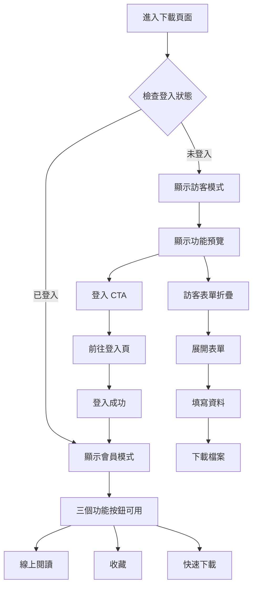

# 下載頁面 UI 重設計方案

## 問題分析

### 現有問題

1. **功能分散**：「線上閱讀」、「收藏」、「下載」按鈕散布在不同區域
2. **視覺混亂**：缺乏統一的視覺焦點
3. **不明確的登入需求**：用戶難以快速理解哪些功能需要登入
4. **重複元素**：多個下載按鈕造成困惑

## 設計目標

- ✨ 將所有需登入功能整合到一個清晰的區域
- 🎯 建立明確的視覺層級
- 🔐 清楚標示登入才能使用的功能
- 🚀 優化用戶轉換流程

## 設計方案

### 方案一：統一功能卡片（推薦）

將三個核心功能整合到一個卡片中，清楚區分會員與訪客功能。

#### 視覺結構

```
┌─────────────────────────────────────┐
│         🎯 完整功能體驗              │
├─────────────────────────────────────┤
│  ┌──────┐  ┌──────┐  ┌──────┐      │
│  │  📖  │  │  ❤️  │  │  ⬇️  │      │
│  │線上  │  │ 收藏 │  │快速  │      │
│  │閱讀  │  │      │  │下載  │      │
│  └──────┘  └──────┘  └──────┘      │
│                                     │
│  [🔐 登入解鎖全部功能]              │
│                                     │
│  ─────── 或 ──────                  │
│                                     │
│  ▼ 訪客下載（需填表）               │
└─────────────────────────────────────┘
```

#### HTML 結構

```html
<div class="action-card">
  <!-- 會員功能區 -->
  <div class="member-features">
    <h3>🎯 完整功能體驗</h3>
    <div class="features-grid">
      <button class="feature-item" data-requires-login="true">
        <span class="icon">📖</span>
        <span class="label">線上閱讀</span>
        <span class="badge">會員專屬</span>
      </button>

      <button class="feature-item" data-requires-login="true">
        <span class="icon">❤️</span>
        <span class="label">收藏</span>
        <span class="badge">會員專屬</span>
      </button>

      <button class="feature-item" data-requires-login="true">
        <span class="icon">⬇️</span>
        <span class="label">快速下載</span>
        <span class="badge">免填表</span>
      </button>
    </div>

    <button class="btn-primary">🔐 登入解鎖全部功能</button>
  </div>

  <!-- 訪客選項 -->
  <div class="guest-option">
    <div class="divider">或</div>
    <details class="guest-form">
      <summary>訪客下載（需填表）</summary>
      <!-- 表單內容 -->
    </details>
  </div>
</div>
```

### 方案二：漸進式功能解鎖

使用視覺化的進度條展示已解鎖的功能。

```
┌─────────────────────────────────────┐
│  功能解鎖進度 [■□□] 1/3             │
├─────────────────────────────────────┤
│  ✅ 檔案下載（已解鎖）              │
│  🔒 線上閱讀（需登入）              │
│  🔒 收藏功能（需登入）              │
│                                     │
│  [登入解鎖更多功能 →]               │
└─────────────────────────────────────┘
```

### 方案三：智慧切換卡片

根據用戶狀態顯示不同的界面。

```html
<!-- 未登入：顯示功能預覽 -->
<div class="smart-card not-logged-in">
  <div class="preview-mode">
    <h3>登入享受完整功能</h3>
    <ul class="feature-list">
      <li>📖 線上直接閱讀</li>
      <li>❤️ 一鍵收藏</li>
      <li>⬇️ 免填表快速下載</li>
    </ul>
    <button class="btn-login">立即登入</button>
  </div>
  <details class="guest-download">
    <summary>繼續以訪客身份下載</summary>
    <!-- 訪客表單 -->
  </details>
</div>

<!-- 已登入：直接顯示操作按鈕 -->
<div class="smart-card logged-in">
  <div class="quick-actions">
    <button class="btn-read">📖 線上閱讀</button>
    <button class="btn-favorite">❤️ 收藏</button>
    <button class="btn-download">⬇️ 下載</button>
  </div>
  <div class="user-info">已登入為：user@example.com</div>
</div>
```

## 詳細互動設計

### 用戶流程圖



### 互動狀態定義

#### 1. 初始載入狀態

- **Loading**: 顯示骨架屏或載入動畫
- **Error**: 顯示錯誤提示和重試按鈕
- **Success**: 根據用戶狀態顯示相應界面

#### 2. 按鈕狀態

```css
/* 正常狀態 */
.btn-primary {
  background: linear-gradient(135deg, #3b82f6, #1d4ed8);
  transition: all 0.3s ease;
}

/* 懸停狀態 */
.btn-primary:hover {
  transform: translateY(-2px);
  box-shadow: 0 6px 20px rgba(59, 130, 246, 0.6);
}

/* 點擊狀態 */
.btn-primary:active {
  transform: translateY(0);
  box-shadow: 0 2px 10px rgba(59, 130, 246, 0.4);
}

/* 禁用狀態 */
.btn-primary:disabled {
  opacity: 0.5;
  cursor: not-allowed;
  transform: none;
}

/* 載入狀態 */
.btn-primary.loading {
  position: relative;
  color: transparent;
}

.btn-primary.loading::after {
  content: "";
  position: absolute;
  width: 20px;
  height: 20px;
  border: 2px solid white;
  border-radius: 50%;
  border-top-color: transparent;
  animation: spin 0.6s linear infinite;
}
```

### 動畫效果設計

#### 1. 頁面切換動畫

```javascript
// 平滑切換視圖
function switchView(fromView, toView) {
  const from = document.getElementById(fromView);
  const to = document.getElementById(toView);

  // 淡出舊視圖
  from.style.animation = "fadeOut 0.3s ease";

  setTimeout(() => {
    from.style.display = "none";
    to.style.display = "block";
    // 淡入新視圖
    to.style.animation = "fadeIn 0.3s ease";
  }, 300);
}

// CSS 動畫定義
const animations = `
  @keyframes fadeIn {
    from { opacity: 0; transform: translateY(10px); }
    to { opacity: 1; transform: translateY(0); }
  }
  
  @keyframes fadeOut {
    from { opacity: 1; transform: translateY(0); }
    to { opacity: 0; transform: translateY(-10px); }
  }
  
  @keyframes slideIn {
    from { transform: translateX(-100%); }
    to { transform: translateX(0); }
  }
  
  @keyframes pulse {
    0%, 100% { transform: scale(1); }
    50% { transform: scale(1.05); }
  }
`;
```

#### 2. 微互動設計

```javascript
// 功能卡片懸停效果
document.querySelectorAll(".feature-item").forEach((item) => {
  item.addEventListener("mouseenter", function () {
    this.style.transform = "translateY(-4px)";
    this.style.boxShadow = "0 8px 24px rgba(0,0,0,0.12)";
  });

  item.addEventListener("mouseleave", function () {
    this.style.transform = "translateY(0)";
    this.style.boxShadow = "0 4px 12px rgba(0,0,0,0.08)";
  });
});

// 按鈕點擊波紋效果
function createRipple(event) {
  const button = event.currentTarget;
  const ripple = document.createElement("span");
  const rect = button.getBoundingClientRect();
  const size = Math.max(rect.width, rect.height);
  const x = event.clientX - rect.left - size / 2;
  const y = event.clientY - rect.top - size / 2;

  ripple.style.width = ripple.style.height = size + "px";
  ripple.style.left = x + "px";
  ripple.style.top = y + "px";
  ripple.classList.add("ripple");

  button.appendChild(ripple);

  setTimeout(() => ripple.remove(), 600);
}
```

## 實施建議

### 優先級排序

1. **立即改善**：整合功能到統一區域（方案一）
2. **短期優化**：改進視覺層級和顏色對比
3. **長期計劃**：根據用戶數據優化流程

### 視覺設計原則

- **層級清晰**：主要 CTA > 次要功能 > 輔助信息
- **顏色運用**：
  - 主要動作（登入/下載）：綠色或藍色
  - 會員專屬：金色或紫色標記
  - 訪客選項：灰色調
- **圖標一致**：統一使用 emoji 或 SVG
- **留白充足**：避免擁擠，提升可讀性

### 文案優化

- 強調會員價值：「登入解鎖 3 大專屬功能」
- 降低訪客阻力：「或以訪客身份繼續」
- 明確指引：使用動詞開頭的按鈕文字

## 預期效果

1. **提升轉換率**

   - 清晰的價值主張促進註冊
   - 簡化的流程減少跳出

2. **改善用戶體驗**

   - 一目了然的功能區分
   - 減少重複和困惑

3. **增強品牌形象**
   - 專業的界面設計
   - 統一的視覺語言

## 技術實作要點

### 統一的狀態管理系統

```javascript
// 增強版狀態管理器
class EnhancedAuthStateManager {
  constructor() {
    this.isLoggedIn = false;
    this.user = null;
    this.features = {
      readOnline: { enabled: false, loading: false },
      favorite: { enabled: false, loading: false },
      download: { enabled: false, loading: false },
    };
    this.listeners = [];
  }

  // 訂閱狀態變化
  subscribe(callback) {
    this.listeners.push(callback);
    return () => {
      this.listeners = this.listeners.filter((l) => l !== callback);
    };
  }

  // 通知狀態變化
  notify() {
    this.listeners.forEach((callback) => callback(this));
  }

  async checkAuth() {
    const token = localStorage.getItem("authToken");
    if (!token) {
      this.setGuestMode();
      return;
    }

    try {
      const response = await fetch("/api/auth/me", {
        headers: { Authorization: `Bearer ${token}` },
      });

      if (response.ok) {
        const data = await response.json();
        this.setMemberMode(data.user);
      } else {
        this.setGuestMode();
        localStorage.removeItem("authToken");
      }
    } catch (error) {
      console.error("Auth check failed:", error);
      this.setGuestMode();
    }
  }

  setMemberMode(user) {
    this.isLoggedIn = true;
    this.user = user;
    this.features = {
      readOnline: { enabled: true, loading: false },
      favorite: { enabled: true, loading: false },
      download: { enabled: true, loading: false },
    };
    this.notify();
    this.renderMemberView();
  }

  setGuestMode() {
    this.isLoggedIn = false;
    this.user = null;
    this.features = {
      readOnline: { enabled: false, loading: false },
      favorite: { enabled: false, loading: false },
      download: { enabled: true, loading: false }, // 訪客可下載但需填表
    };
    this.notify();
    this.renderGuestView();
  }

  renderMemberView() {
    const container = document.querySelector(".action-card");
    container.innerHTML = `
      <div class="member-view" style="animation: fadeIn 0.3s ease;">
        <!-- 用戶問候 -->
        <div class="user-greeting">
          <div class="user-avatar">${this.user.name[0].toUpperCase()}</div>
          <div class="user-info">
            <h4>歡迎回來，${this.user.name}！</h4>
            <p>享受完整功能體驗</p>
          </div>
        </div>
        
        <!-- 功能按鈕網格 -->
        <div class="feature-grid">
          <button class="feature-btn read-online" onclick="handleReadOnline()">
            <span class="icon">📖</span>
            <span class="label">線上閱讀</span>
            <span class="status">可用</span>
          </button>
          
          <button class="feature-btn favorite" onclick="handleFavorite()">
            <span class="icon">❤️</span>
            <span class="label">收藏</span>
            <span class="status">可用</span>
          </button>
          
          <button class="feature-btn download" onclick="handleQuickDownload()">
            <span class="icon">⬇️</span>
            <span class="label">快速下載</span>
            <span class="status">免填表</span>
          </button>
        </div>
        
        <!-- 額外功能 -->
        <div class="extra-features">
          <button class="btn-secondary" onclick="handleShare()">
            <svg><!-- share icon --></svg>
            分享頁面
          </button>
          <button class="btn-text" onclick="viewHistory()">
            查看下載歷史
          </button>
        </div>
      </div>
    `;
  }

  renderGuestView() {
    const container = document.querySelector(".action-card");
    container.innerHTML = `
      <div class="guest-view" style="animation: fadeIn 0.3s ease;">
        <!-- 功能預覽區 -->
        <div class="features-preview">
          <h3>🎯 完整功能一覽</h3>
          <div class="preview-grid">
            <div class="preview-item locked">
              <div class="icon">📖</div>
              <div class="content">
                <h4>線上閱讀</h4>
                <p>無需下載，直接瀏覽</p>
                <span class="badge">需登入</span>
              </div>
            </div>
            
            <div class="preview-item locked">
              <div class="icon">❤️</div>
              <div class="content">
                <h4>收藏功能</h4>
                <p>建立個人資料庫</p>
                <span class="badge">需登入</span>
              </div>
            </div>
            
            <div class="preview-item available">
              <div class="icon">⬇️</div>
              <div class="content">
                <h4>檔案下載</h4>
                <p>會員免填表單</p>
                <span class="badge success">可用</span>
              </div>
            </div>
          </div>
        </div>
        
        <!-- 登入 CTA -->
        <div class="login-cta">
          <h4>登入解鎖全部功能</h4>
          <ul class="benefits-list">
            <li>✅ 線上直接閱讀，無需下載檔案</li>
            <li>✅ 收藏喜愛內容，隨時查看</li>
            <li>✅ 一鍵快速下載，免填表單</li>
            <li>✅ 查看完整下載歷史</li>
          </ul>
          <button class="btn-primary large" onclick="goToLogin()">
            <span class="icon">👤</span>
            立即登入
          </button>
        </div>
        
        <!-- 訪客下載選項 -->
        <div class="guest-download-section">
          <div class="divider">
            <span>或繼續以訪客身份</span>
          </div>
          
          <details class="guest-form-wrapper">
            <summary class="toggle-form">
              訪客下載（需填寫資料）
              <span class="arrow">▼</span>
            </summary>
            
            <form class="guest-form" onsubmit="handleGuestDownload(event)">
              <div class="form-group">
                <label>姓名 <span class="required">*</span></label>
                <input type="text" name="name" required>
              </div>
              
              <div class="form-group">
                <label>電子郵件 <span class="required">*</span></label>
                <input type="email" name="email" required>
              </div>
              
              <div class="form-group">
                <label>
                  <input type="checkbox" name="subscribe">
                  接收更新通知
                </label>
              </div>
              
              <button type="submit" class="btn-secondary">
                提交並下載
              </button>
            </form>
          </details>
        </div>
      </div>
    `;
  }
}

// 初始化管理器
const authManager = new EnhancedAuthStateManager();
document.addEventListener("DOMContentLoaded", () => {
  authManager.checkAuth();
});
```

### 功能處理函數

```javascript
// 線上閱讀處理
async function handleReadOnline() {
  if (!authManager.isLoggedIn) {
    showLoginPrompt("需要登入才能使用線上閱讀功能");
    return;
  }

  // 顯示載入狀態
  const btn = event.currentTarget;
  btn.classList.add("loading");

  try {
    // 開啟預覽窗口或導向預覽頁面
    window.open(`/preview/${pageSlug}`, "_blank");
  } catch (error) {
    showError("無法開啟預覽");
  } finally {
    btn.classList.remove("loading");
  }
}

// 收藏處理
async function handleFavorite() {
  if (!authManager.isLoggedIn) {
    showLoginPrompt("需要登入才能使用收藏功能");
    return;
  }

  const btn = event.currentTarget;
  btn.classList.add("loading");

  try {
    const response = await fetch(`/api/favorite/${pageId}`, {
      method: "POST",
      headers: {
        Authorization: `Bearer ${localStorage.getItem("authToken")}`,
        "Content-Type": "application/json",
      },
    });

    if (response.ok) {
      btn.classList.add("favorited");
      showSuccess("已加入收藏");
    }
  } catch (error) {
    showError("收藏失敗");
  } finally {
    btn.classList.remove("loading");
  }
}

// 快速下載處理
async function handleQuickDownload() {
  if (!authManager.isLoggedIn) {
    // 訪客需要填表
    document.querySelector(".guest-form-wrapper").open = true;
    document.querySelector(".guest-form-wrapper").scrollIntoView({
      behavior: "smooth",
    });
    return;
  }

  const btn = event.currentTarget;
  btn.classList.add("loading");

  try {
    const response = await fetch(`/download-page/${pageSlug}/quick`, {
      method: "POST",
      headers: {
        Authorization: `Bearer ${localStorage.getItem("authToken")}`,
      },
    });

    const data = await response.json();
    if (data.success) {
      // 開始下載
      const a = document.createElement("a");
      a.href = data.downloadUrl;
      a.download = "";
      a.click();

      showSuccess("下載已開始");
    }
  } catch (error) {
    showError("下載失敗");
  } finally {
    btn.classList.remove("loading");
  }
}

// 訪客下載處理
async function handleGuestDownload(event) {
  event.preventDefault();

  const form = event.target;
  const submitBtn = form.querySelector('button[type="submit"]');
  submitBtn.classList.add("loading");

  const formData = new FormData(form);

  try {
    const response = await fetch(`/download-page/${pageSlug}/submit`, {
      method: "POST",
      headers: { "Content-Type": "application/json" },
      body: JSON.stringify({
        name: formData.get("name"),
        email: formData.get("email"),
        subscribe: formData.get("subscribe") === "on",
      }),
    });

    const data = await response.json();
    if (data.success) {
      // 開始下載
      const a = document.createElement("a");
      a.href = data.downloadUrl;
      a.download = "";
      a.click();

      // 顯示成功訊息
      showSuccess("感謝您！下載即將開始");

      // 清空表單
      form.reset();
    }
  } catch (error) {
    showError("提交失敗，請稍後再試");
  } finally {
    submitBtn.classList.remove("loading");
  }
}

// 輔助函數：顯示提示
function showLoginPrompt(message) {
  const modal = createModal({
    title: "需要登入",
    content: `
      <div class="login-prompt-modal">
        <div class="icon">🔐</div>
        <p>${message}</p>
        <div class="actions">
          <button onclick="closeModal()" class="btn-secondary">取消</button>
          <button onclick="goToLogin()" class="btn-primary">前往登入</button>
        </div>
      </div>
    `,
  });
  document.body.appendChild(modal);
}

function showSuccess(message) {
  const toast = createToast(message, "success");
  document.body.appendChild(toast);
  setTimeout(() => toast.remove(), 3000);
}

function showError(message) {
  const toast = createToast(message, "error");
  document.body.appendChild(toast);
  setTimeout(() => toast.remove(), 3000);
}
```

### 響應式設計考量

```css
/* 手機版調整 */
@media (max-width: 768px) {
  .feature-grid {
    grid-template-columns: 1fr;
    gap: 12px;
  }

  .feature-btn {
    min-height: 60px;
    font-size: 16px;
  }

  .btn-primary.large {
    width: 100%;
    padding: 16px;
    font-size: 18px;
  }

  .preview-grid {
    grid-template-columns: 1fr;
  }

  .user-greeting {
    flex-direction: column;
    text-align: center;
  }
}

/* 平板調整 */
@media (min-width: 769px) and (max-width: 1024px) {
  .feature-grid {
    grid-template-columns: repeat(2, 1fr);
  }

  .preview-grid {
    grid-template-columns: repeat(2, 1fr);
  }
}

/* 桌面版優化 */
@media (min-width: 1025px) {
  .action-card {
    max-width: 800px;
    margin: 0 auto;
  }

  .feature-grid {
    grid-template-columns: repeat(3, 1fr);
    gap: 20px;
  }

  .preview-grid {
    grid-template-columns: repeat(3, 1fr);
  }
}
```

### 無障礙性設計

```javascript
// 鍵盤導航支援
document.querySelectorAll(".feature-btn").forEach((btn, index) => {
  btn.setAttribute("tabindex", index + 1);
  btn.setAttribute("role", "button");
  btn.setAttribute("aria-label", btn.querySelector(".label").textContent);

  // Enter 和空格鍵觸發
  btn.addEventListener("keydown", (e) => {
    if (e.key === "Enter" || e.key === " ") {
      e.preventDefault();
      btn.click();
    }
  });
});

// 螢幕閱讀器提示
function announceToScreenReader(message) {
  const announcement = document.createElement("div");
  announcement.setAttribute("role", "alert");
  announcement.setAttribute("aria-live", "polite");
  announcement.style.position = "absolute";
  announcement.style.left = "-10000px";
  announcement.textContent = message;

  document.body.appendChild(announcement);
  setTimeout(() => announcement.remove(), 1000);
}

// ARIA 標籤
document.querySelector(".action-card").setAttribute("role", "region");
document.querySelector(".action-card").setAttribute("aria-label", "頁面操作區");
document
  .querySelector(".guest-form-wrapper")
  .setAttribute("aria-expanded", "false");

// 切換表單展開狀態
document
  .querySelector(".guest-form-wrapper")
  .addEventListener("toggle", (e) => {
    e.target.setAttribute("aria-expanded", e.target.open);
  });
```

## 測試重點

1. **A/B 測試**

   - 測試不同方案的轉換率
   - 追蹤用戶行為路徑

2. **響應式設計**

   - 手機版的按鈕大小和間距
   - 平板的布局調整

3. **無障礙性**
   - 鍵盤導航支援
   - 螢幕閱讀器相容性

## 效能優化建議

### 1. 延遲載入

```javascript
// 延遲載入非關鍵資源
const lazyLoadFeatures = () => {
  if ("IntersectionObserver" in window) {
    const observer = new IntersectionObserver((entries) => {
      entries.forEach((entry) => {
        if (entry.isIntersecting) {
          // 載入功能模組
          import("./features.js").then((module) => {
            module.initFeatures();
          });
          observer.unobserve(entry.target);
        }
      });
    });

    observer.observe(document.querySelector(".action-card"));
  }
};
```

### 2. 狀態快取

```javascript
// 快取認證狀態
const cacheAuthState = {
  set(state) {
    sessionStorage.setItem(
      "authState",
      JSON.stringify({
        ...state,
        timestamp: Date.now(),
      })
    );
  },

  get() {
    const cached = sessionStorage.getItem("authState");
    if (!cached) return null;

    const state = JSON.parse(cached);
    // 5 分鐘內有效
    if (Date.now() - state.timestamp < 300000) {
      return state;
    }
    return null;
  },
};
```

### 3. 預載入關鍵資源

```html
<!-- 預載入字體 -->
<link rel="preload" href="/fonts/inter.woff2" as="font" crossorigin />

<!-- 預連接 API -->
<link rel="preconnect" href="https://api.example.com" />

<!-- 預取下一步可能的頁面 -->
<link rel="prefetch" href="/login" />
```

## 結論

透過整合分散的功能、建立清晰的視覺層級，以及優化用戶流程，新的 UI 設計將能：

- 提升用戶體驗
- 增加會員轉換
- 減少使用困惑

建議優先實施方案一（統一功能卡片），並根據用戶反饋持續優化。
